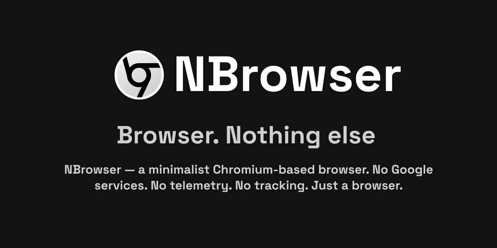

# NBrowser



**A clean, privacy-focused web browser for Windows.**

NBrowser is a streamlined Chromium-based browser focused on privacy, performance and a simpler user experience — removing unnecessary features, services, integrations and background activity while keeping the modern web compatible.

> NBrowser is currently in active development.

---

## ✨ What is NBrowser?

NBrowser is built on top of the Chromium browser engine, with a different approach to the browser experience.

Instead of shipping every feature and service by default, NBrowser aims to provide a cleaner and more focused browser with:

- 🧹 Less unnecessary functionality
- 🔒 Privacy-focused defaults
- 📡 No added telemetry or analytics
- 🚫 No unnecessary online services
- 🪶 Lightweight and focused experience

NBrowser is designed for people who want a browser that stays out of the way.

---

## 🎯 Project Goals

NBrowser is built around a simple idea:

> **A browser should be a browser — not a collection of services you never asked for.**

The project focuses on:

- Removing unnecessary features
- Removing unwanted integrations
- Reducing background activity
- Eliminating unnecessary telemetry
- Simplifying the settings and user interface
- Providing sensible privacy defaults
- Keeping the core browsing experience fast and compatible
- Giving users more control over the browser

---

## 🛡️ Privacy

Privacy is one of the primary goals of NBrowser.

NBrowser aims to remove or disable unnecessary data collection, analytics and telemetry from the browser.

The project is specifically being developed to avoid:

- Usage analytics
- Unnecessary telemetry
- Background tracking
- Unwanted cloud integrations
- Unnecessary data collection
- Unrequested online services

NBrowser does not add its own advertising or tracking systems.

> Privacy claims will be documented and verified as development progresses.

---

## 🧹 What is being removed?

NBrowser is intentionally more selective about the functionality included in the browser.

The project is working toward removing features and integrations that are not considered essential to the core browsing experience, including things such as:

- Unwanted AI integrations
- Unnecessary tab-management features
- Live Caption and related functionality
- Profile management
- Web App / application installation functionality
- Unnecessary background services
- Unused settings and configuration options
- Unnecessary online integrations

The exact feature set may change during development.

---

## 🖼️ Screenshots

### Main window

*Coming soon.*

### Settings

*Coming soon.*

### Customization

*Coming soon.*

> Screenshots show the current NBrowser interface. The UI may change between releases.

---

## 📥 Download

NBrowser releases are distributed through the official GitHub Releases page.

**Official download:**

[Download the latest NBrowser release →](https://github.com/Nothing-Software/NBrowser-windows/releases/latest)

> NBrowser is currently in development. Stable releases will be published when the project reaches a suitable state.

### 🛡️ Safety

Please do not rely on unofficial mirrors or modified builds.

If you found an NBrowser installer somewhere other than the official repository or official website, it may not be an official NBrowser build.

Official sources:

- 🌐 Official website — *coming soon*
- 🐙 [GitHub Releases](https://github.com/Nothing-Software/NBrowser-windows/releases)

NBrowser does not endorse or support third-party builds.

---

## 🔐 Why Chromium?

NBrowser uses Chromium as its browser engine rather than developing a web engine from scratch.

This allows NBrowser to focus development on:

- Privacy
- User experience
- Browser functionality
- UI customization
- Removing unnecessary components
- Windows integration

while relying on an established browser engine for rendering modern websites.

NBrowser is a separate project with its own modifications and configuration.

---

## 🧩 Architecture

NBrowser is developed as a downstream browser project.

```text
Chromium
   │
   ├── Browser engine
   ├── Blink
   ├── V8
   ├── Networking
   ├── GPU / Rendering
   └── Windows integration
            │
            ▼
      NBrowser patches
            │
   ┌────────┼────────┐
   │        │        │
Branding  Privacy  Features
   │        │        │
   └────────┼────────┘
            ▼
         NBrowser
